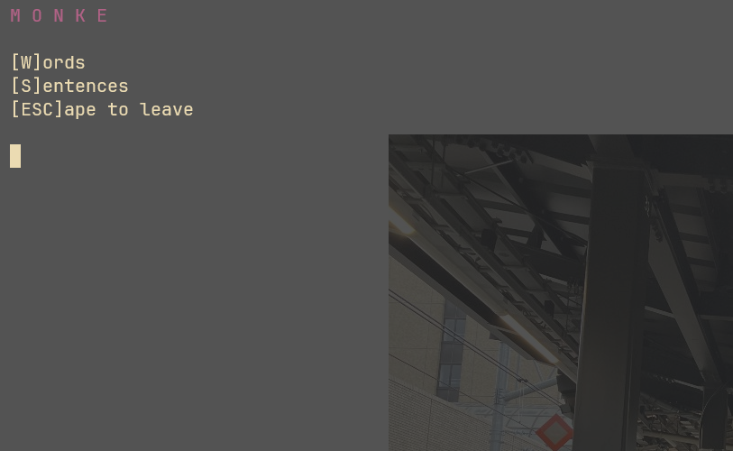
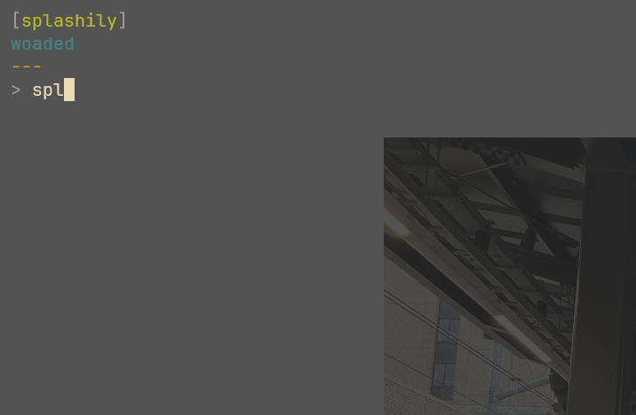
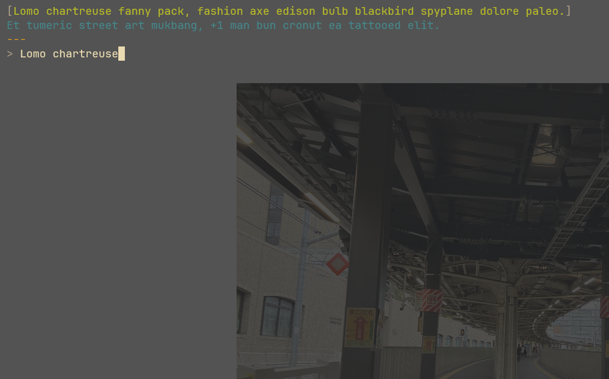
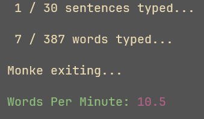

# `monke`


ape brain goes klik klak

## installation

```console
$ git clone https://github.com/gongahkia/monke
$ cd monke
$ make config
```

## usage

```console
$ make
```

## screenshots




