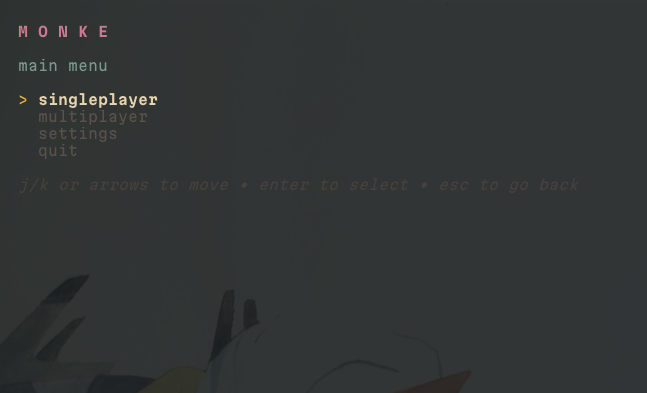
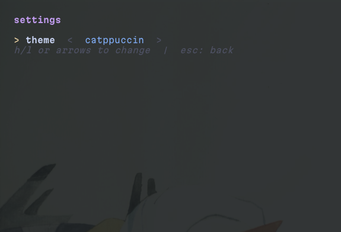
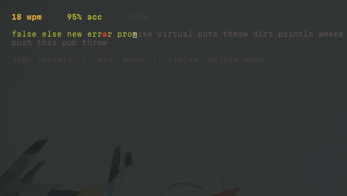
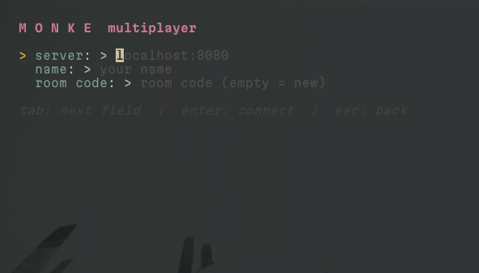

[](https://github.com/gongahkia/monke/releases/tag/1.0.0)
[](https://github.com/gongahkia/monke/releases/tag/2.0.0)

# `Monke`

Ape brain goes ***klik klak***.

## Stack

* *Script*: [Go](https://go.dev/)

## Screenshots

<div align="center">
    
    
</div>

<div align="center">
    
    
</div>

## Usage

The below instructions are for locally running `Monke` [singleplayer](#singleplayer) or [multiplayer](#multiplayer) on your machine.

1. First run the below to clone the repository on your device.

```console
$ git clone https://github.com/gongahkia/monke && cd monke
$ go build -o bin/monke ./cmd/monke
$ go build -o bin/monke-server ./cmd/monke-serverig
```

2. Then run any of the below commands to use `Monke`'s functionality.

```console
$ make run
$ make run-server
$ ./bin/monke 
$ ./bin/monke-server 
```