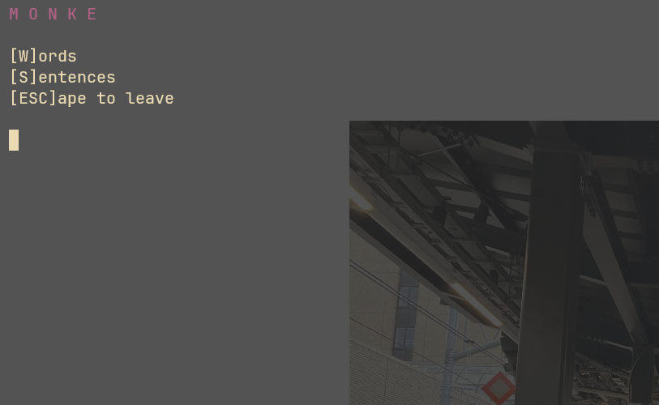
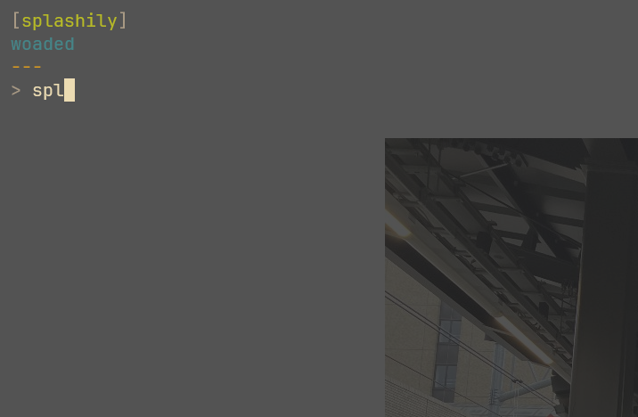
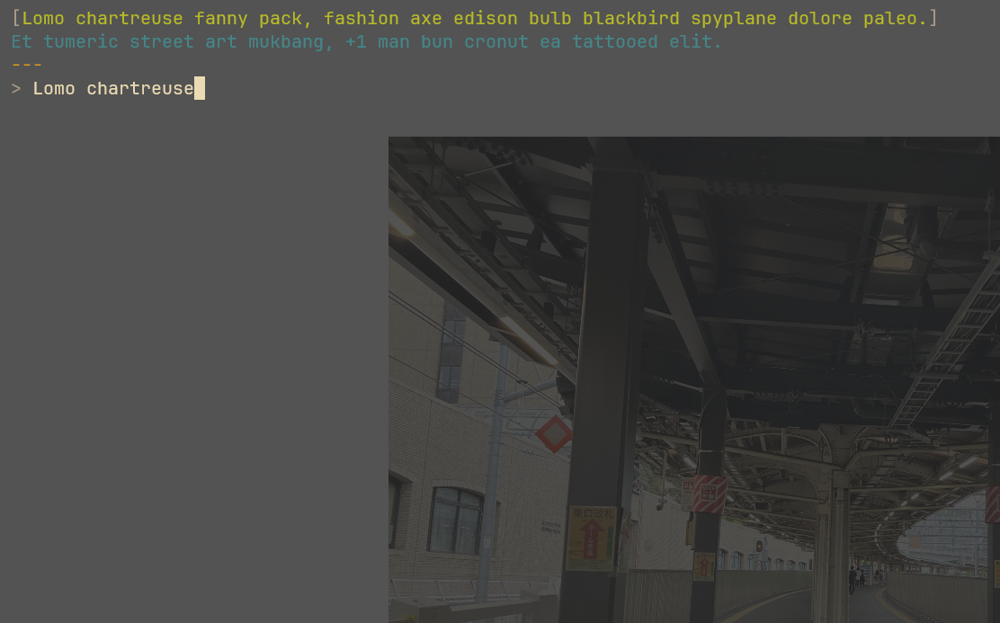
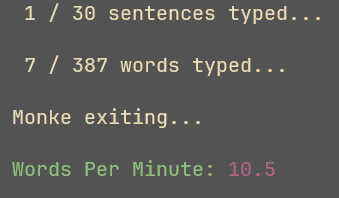

# `monke`


CLI typing test. MonkeyType for your terminal.

## features

* char-level accuracy tracking (correct/incorrect/extra/missed)
* raw WPM, net WPM, consistency
* time modes: 15s, 30s, 60s, 120s
* word count modes: 10, 25, 50, 100
* word lists: english 200/1k/5k, code keywords
* 6 themes: catppuccin, dracula, nord, gruvbox, monokai, tokyonight
* persistent results + PB tracking (`~/.config/monke/`)
* networked multiplayer (WebSocket) with lobby + race

## install

```console
$ git clone https://github.com/gongahkia/monke
$ cd monke
$ go build -o bin/monke ./cmd/monke
$ go build -o bin/monke-server ./cmd/monke-server
```

Requires Go 1.22+.

## usage

```console
$ ./bin/monke          # or: make run
$ ./bin/monke-server   # or: make run-server (default :8080)
```

### singleplayer

Menu: pick mode (time/words) > duration/count > word list > type.

`tab` restart | `esc` menu | `ctrl+w` delete word

### multiplayer

1. Start server: `make run-server`
2. In client: multiplayer > enter server addr > name > room code (empty = create)
3. All players press enter to ready
4. 5s countdown, then race

## screenshots





